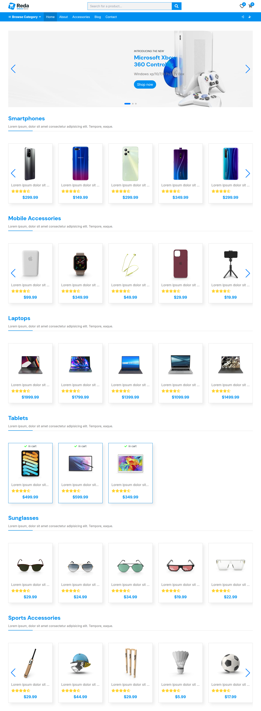
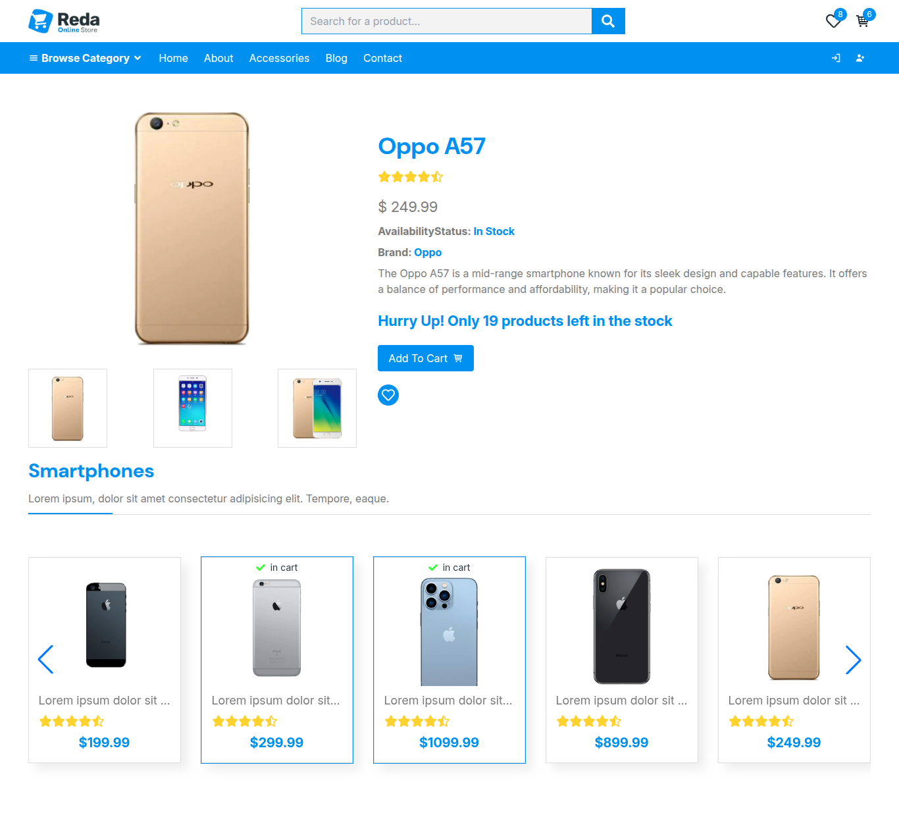
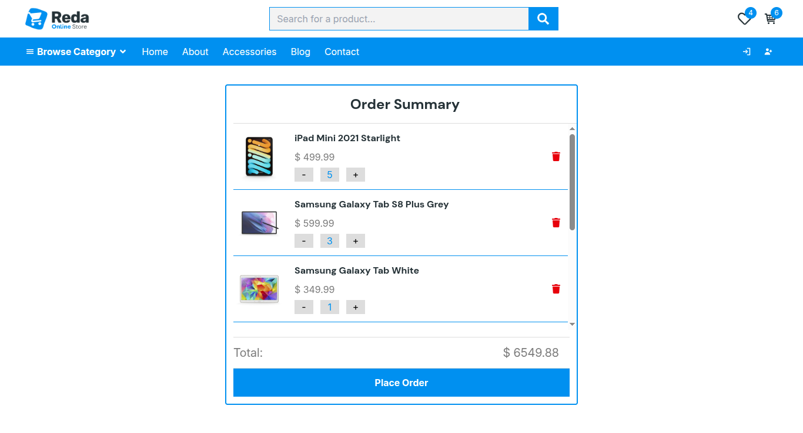
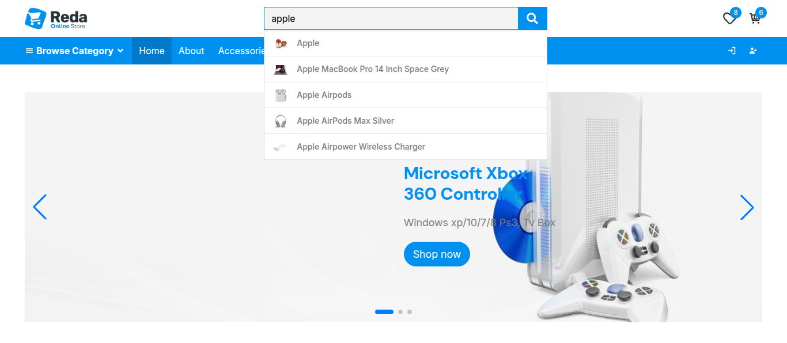

# 🛒 E-Commerce Platform (React + TypeScript)

A modern, fast, and fully responsive E-Commerce web application built using **React**, **TypeScript**, and **Tailwind CSS**, powered by the **DummyJSON API**.

---

## 🚀 Features

- **Dynamic Data Fetching:** Fetches products by multiple categories efficiently using `Promise.all`.
- **Global State Management:** Context API used for Cart and Favorites with localStorage persistence.
- **Live Search Suggestions:** Real-time search with debouncing mechanism (300ms) to optimize API calls.
- **Skeleton Loading Screen:** Animated shimmering placeholders to enhance perceived performance and UX.
- **Responsive UI Components:** Integrated Swiper.js for premium product sliders and react-hot-toast for feedback notifications.

---

## 📸 Preview & Screenshots

<p align="center">
  
  
</p>

<p align="center">
  
  
</p>

---

## 🛠️ Tech Stack

- **Frontend:** React (Functional Components, Hooks)
- **Type Safety:** TypeScript
- **Styling:** Tailwind CSS, SASS / SCSS
- **Routing:** React Router DOM
- **Libraries:** Swiper.js, React Hot Toast, React Icons

---

## 🔧 Installation & Setup

Follow these steps to run the project locally on your machine:

### 1. Prerequisites

Make sure you have **Node.js** (v18 or higher recommended) and **npm** installed. You can check your version by running:

```bash
node -v
npm -v
```

### 2. Clone the Repository

Clone this project to your local machine using Git:

```bash
git clone https://github.com/Xertenz/EcommerceReact
```

### 3. Navigate to the Project Directory

```bash
cd EcommerceReact
```

### 4. Install Dependencies

Install all the required packages (React, TypeScript, Tailwind, Swiper, React Hot Toast, Icons, etc.):

```bash
npm install
```

### 5. Run the Development Server

Start the local development server (Vite):

```bash
npm run dev
```

### 6. Open the Application

Once the server starts, open your browser and navigate to:
http://localhost:5173 (or the port provided in your terminal).

### 7. Production Build

To build the application for production deployment:

```bash
npm run build
```

This will generate a highly optimized dist folder ready to be deployed on platforms like Vercel, Netlify, or GitHub Pages.
